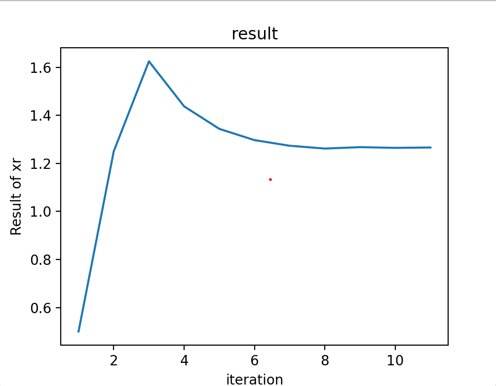
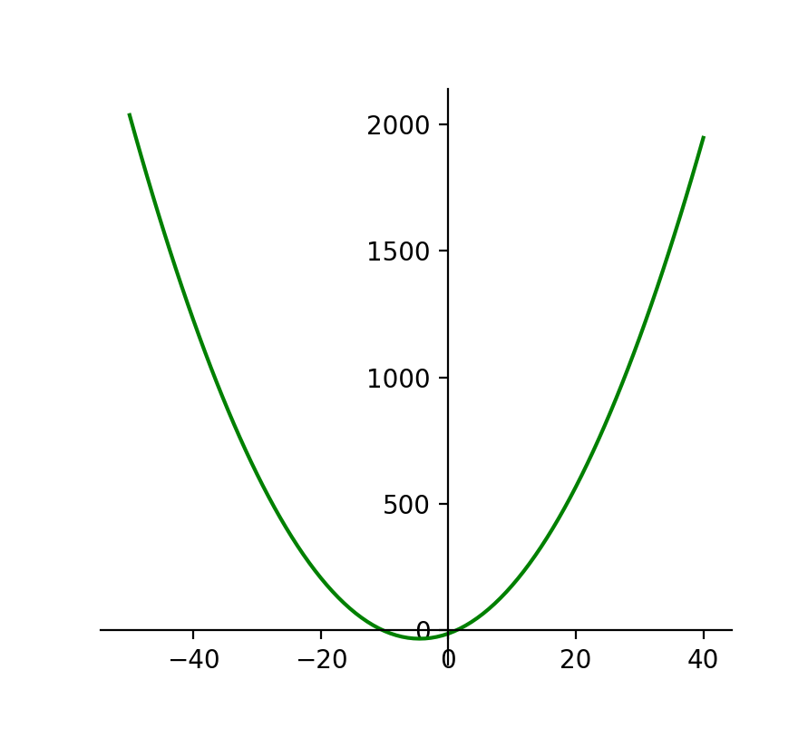
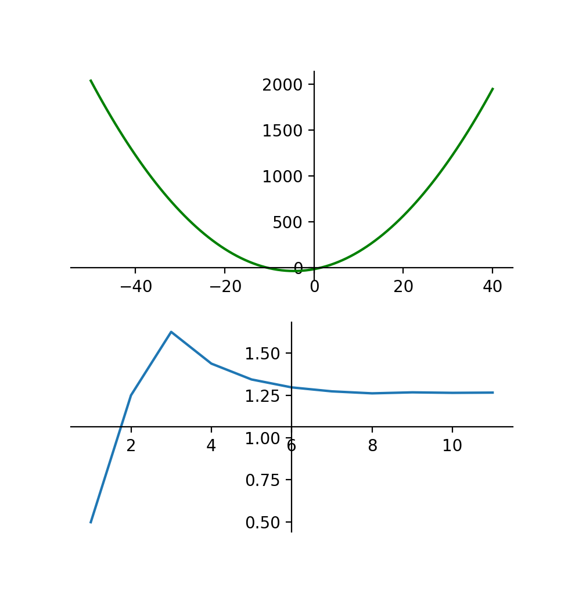

# Praktikum Komputasi Numerik Modul 1
**<br>Dimas Fadilah Akbar_5025211010**
**<br>Abdullah Yasykur Bifadhlil Midror_5025211035**
**<br>Achmad Khosyi' Assajjad Ramandanta_5025211007**
**<br>Arkana Bilal Imani_5025211034**
**<br>Duevano Fairuz Pandya_5025211052**


## Requirement
- Python 3.9.12
- Code Editor

## Instalasi Library
- numpy
- math
- matplotlib
> Pada praktikum komputasi numerik modul 1 membutuhkan 2 instalasi library yaitu numpy dan matplotlib. Kita bisa lakukan instalasi dengan menggunakan pip.
``` 
pip install numpy
pip install matplotlib
```

## Soal Praktikum
> Implementasikan algoritma metode Bolzano menjadi sebuah program komputer yang dapat
menampilkan proses iteratif numerik, lengkap dengan grafik fungsinya.

## Penjelasan Kode 
#### import library yang dibutuhkan
```py
import numpy as np
import matplotlib.pyplot as plt
import math
```
library numpy dibutuhan untuk membuat array dengan isi sekumpulan nilai xr dan juga berisi banyak iterasi yang kita lakukan. library matplotlib digunakan untuk membuat grafik dengan parameter array yang diberikan.

### Membuat inputan
```py
xl = float(input("masukkan x lower: "))
xu = float(input("masukkan x upper: "))
iterate = int(input("masukkan jumlah interasi: "))
xt = 1.26611328125
```
code diatas merupakan inputan untuk x lower, x upper, dan jumlah iterasi yang kita inginkan. Kemudian juga di deklarasi x true nya yaitu 1.26611328125 yang digunakan untuk mencari error truenya.

### Membuat list
```py
list_xr = list()
list_iterate = list()
```
list_xr merupakan array yang akan menyimpan value dari xr untuk tiap iterasi, sedangkan list_iterate akan menyimpan nilai iterasinya.

### Deklarasi fungsinya
```py
def function(x):
    return x*x + 9*x - 13
```
fungsi dapat diubah sesuai dengan persoalan bolzano yang ingin diselesaikan, disini kami menggunakan persoalan fungsi x^2 + 9x -13 

### Program Bolzano atau Biseksi  
```py
def bisection():
    global xl, xu
    for i in range(iterate):
        xr = (xl+xu)/2
        list_xr.append(xr)
        list_iterate.append(i+1)
        
        print(f"iterasi ke - {i+1}")
        print(f"xu dan xl: {xu} || {xl}")
        print(f"xr dan xt: {xr} || {xt}")

        et = round(math.fabs((xt-xr)/xt), 5)
        print(f"et: {et}\n")

        fxl = function(xl)
        fxr = function(xr)

        mul = round(fxl * fxr, 3)
        if(mul == 0):
            print(f"hasil faktor: {xr} ")
            return
        elif (mul) < 0:
            xu = xr
        elif mul > 0:
            xl = xr
```
Kode diatas merupakan implementasi dari metode bolzano untuk mencari faktor dari sebuah fungsi yang telah ditentukan.

### Menampilkan Grafik
```py
plt.title("result")
plt.xlabel("iteration")
plt.ylabel("Result of xr")
plt.plot(list_iterate, list_xr)
plt.show()
```
Dari x lower, x upper, dan iterasi yang diinputkan kita bisa lakukan plotting menggunakan library matplotlib dengan parameter list_iterate sebagai absis dan list_xr sebagai oordinatnya.

### Contoh Inputan
```
xl = -1
xr = 2
iterate = 13
```
dari contoh inputan diatas, degnan mengimplementasikan pada program yang telah dibuat maka didapatkan hasil:
```
masukkan x lower: -1
masukkan x upper: 2
masukkan jumlah interasi: 13
iterasi ke - 1
xu dan xl: 2.0 || -1.0
xr dan xt: 0.5 || 1.26611328125
et: 0.60509

iterasi ke - 2
xu dan xl: 2.0 || 0.5
xr dan xt: 1.25 || 1.26611328125
et: 0.01273

iterasi ke - 3
xu dan xl: 2.0 || 1.25
xr dan xt: 1.625 || 1.26611328125
et: 0.28346

iterasi ke - 4
xu dan xl: 1.625 || 1.25
xr dan xt: 1.4375 || 1.26611328125
et: 0.13536

iterasi ke - 5
xu dan xl: 1.4375 || 1.25
xr dan xt: 1.34375 || 1.26611328125
et: 0.06132

iterasi ke - 6
xu dan xl: 1.34375 || 1.25
xr dan xt: 1.296875 || 1.26611328125
et: 0.0243

iterasi ke - 7
xu dan xl: 1.296875 || 1.25
xr dan xt: 1.2734375 || 1.26611328125
et: 0.00578

iterasi ke - 8
xu dan xl: 1.2734375 || 1.25
xr dan xt: 1.26171875 || 1.26611328125
et: 0.00347

iterasi ke - 9
xu dan xl: 1.2734375 || 1.26171875
xr dan xt: 1.267578125 || 1.26611328125
et: 0.00116

iterasi ke - 10
xu dan xl: 1.267578125 || 1.26171875
xr dan xt: 1.2646484375 || 1.26611328125
et: 0.00116

iterasi ke - 11
xu dan xl: 1.267578125 || 1.2646484375
et: 0.0

hasil faktor: 1.26611328125
```
**maka didapatkan hasil akhir faktornya adalah 1.26611328125.**

## Grafik Iterasi dan Xr
berikut merupakan grafik yang memplot hasil xr pada tiap iterasi yang dilakukan.




## Menampilkan Grafik Fungsi
```py
x_point = np.linspace(-50, 40, 100);
y_point = function(x_point)
```

kode diatas akan melakukann plotting dari x=-50 hingga x=40 dengan y merupakan nilai dari f(x)-nya. 

```py
fig = plt.figure()
ax1 = fig.add_subplot(1, 1, 1)
ax1.spines['left'].set_position('zero')
ax1.spines['bottom'].set_position('zero')
ax1.spines['right'].set_color('none')
ax1.spines['top'].set_color('none')
ax1.xaxis.set_ticks_position('bottom')
ax1.yaxis.set_ticks_position('left')
plt.plot(x_point, y_point, 'g')
```
kode diatas akan menampilkan fungsi dari persamaan yang sebelumnya telah ditentukan. set_position digunakan untuk menentukan titik tengah dari posisinya yang mana kami set menjadi (0, 0). Grafiknya adalah sebagai berikut:




## Menampilkan kedua grafik
```py
fig = plt.figure()
ax1 = fig.add_subplot(2, 1, 1)
ax1.spines['left'].set_position('zero')
ax1.spines['bottom'].set_position('zero')
ax1.spines['right'].set_color('none')
ax1.spines['top'].set_color('none')
ax1.xaxis.set_ticks_position('bottom')
ax1.yaxis.set_ticks_position('left')
plt.plot(x_point, y_point, 'g')

ax2 = fig.add_subplot(2, 1, 2)
ax2.spines['left'].set_position('center')
ax2.spines['bottom'].set_position('center')
ax2.spines['right'].set_color('none')
ax2.spines['top'].set_color('none')
ax2.xaxis.set_ticks_position('bottom')
ax2.yaxis.set_ticks_position('left')
plt.plot(list_iterate, list_xr)

plt.show()
```

Menggabungkan kedua grafik diatas dapat kita gunakan fungsi add_subplot dengan parameter (row, column, position), dengan letak grafik fungsi pada baris pertama, dan grafik xr terdapat pada baris kedua. 




